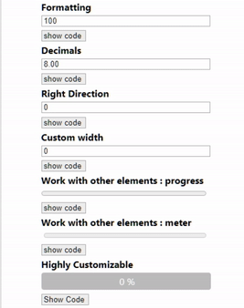
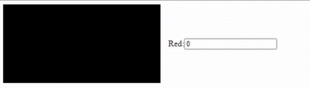

# Side Slider 
[Live Demo](https://mhmd-22.github.io/side-slider/)

Lightweight library for creating side sliders to easily and precisely adjust values by taking advantage of Pointer Lock API.

This is can be extremly useful in such cases like editings position, size, and color values that required a lot of precision and easy to control.

## Preview



## Example

```javascript
const canvas = document.getElementById('canvas_1');
const ctx = canvas.getContext('2d');

const inputRed = document.getElementById('input_red');

SideSlider(inputRed, {
  min: 0,
  max: 255,
  step: 1,
  threshold: 16,
  onChange: function (e) {
    let red = e.value;

    let { width, height } = canvas;
    ctx.clearRect(0, 0, width, height);

    ctx.fillStyle = `rgb(${red}, 0, 0)`;
    ctx.fillRect(0, 0, width, height);
  },
});
```

Should be like this:



[Live](https://mhmd-22.github.io/side-slider/example.html)


More examples in [demo](https://github.com/mhmd-22/side-slider/tree/master/demo) folder

## Usage

`SideSlider(HTMLElement element, Object options)`

**Available options :**

-   **min**(default: **`0`**): Minimum value.
-   **max**(default: **`100`**) : Maximum value.
-   **step**(default: **`1`**) : See threshold.

    **NOTE :** if min, max, and step is not present. it will try to get values from element attributes

-   **width**(default: **`4`**) : Width of area in which slider should be dragged
-   **threshold**(default: **`4`**) : Number of pixels needed to adjust one step, useful for higher precision.
-   **maxMovementX**(default: **`2`**) : Limit the acceleration of mouse movement.
-   **updateElement**(default: **`true`**) : Enable updating the value/textContent of the target element.
-   **direction**(default: **`left`**) : Direction of slider.
-   **format**(default: **`toFixed(0)`**) : Format the output value/textContent of element, For example, adding percentage symbol or round numbers.

```javascript
    // by defualt. the value will be rounded
    format: value => value.toFixed(0); // 2.5999999999999996 -> 3

    // to allow decimals
    format: value => value.toFixed(2); // 2.5999999999999996 -> 2.60

    // add percentage symbol
    format: opacity => `${opacity.toFixed(0)}%`; 39 -> 39%
```

-   **onChange**({value, prev, delta, slider, target}) : to track value changes. and modifying or cancel the value
    -   **value** : New current value.
    -   **prev**: Previous value.
    -   **delta**: Difference between the new and previous value.
    -   **slider**: All configurations are stored in this object.
    -   **target**: The target HTMLElement is linked to slider.

```javascript
    // cancel the change when value goes above 50
    // returning false will cancel the change
    onChange: e => e.value >= 50;

    // change the value by returning a number
    onChange: e => e.value * 2;

    // inspect event object
    onChange: e => console.table(e);
```
